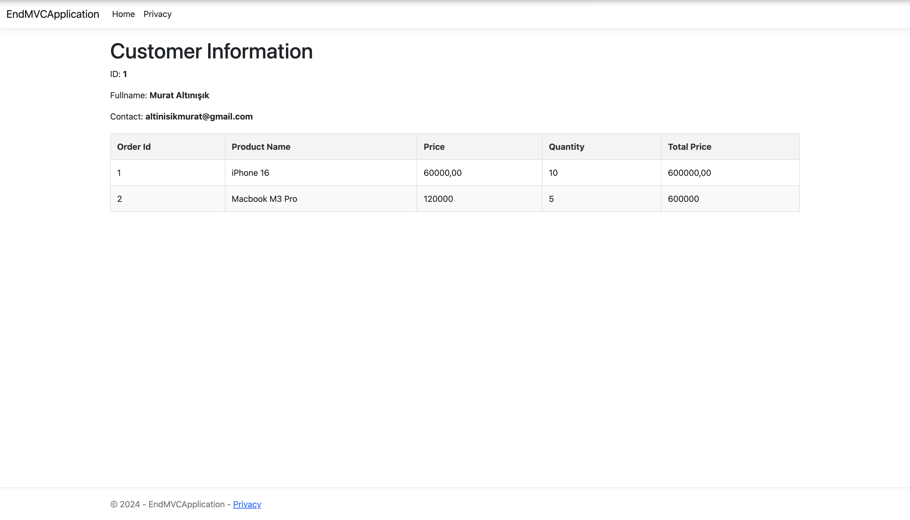

# Customer and Order Management Application



This is a simple ASP.NET MVC application designed to display customer and order details. The application is structured using the MVC pattern and incorporates models, a view model, a controller, and a view.

## Features
- Display customer details (ID, first name, last name, and email).
- Show a list of orders with details such as order ID, product name, price, and quantity.
- Organized project structure following MVC best practices.

## Project Structure

### 1. Models

#### Customer Model
Represents a customer with the following properties:
- **Id**: Unique identifier for the customer (int).
- **FirstName**: Customer's first name (string).
- **LastName**: Customer's last name (string).
- **Email**: Customer's email address (string).

#### Order Model
Represents an order with the following properties:
- **Id**: Unique identifier for the order (int).
- **ProductName**: Name of the product (string).
- **Price**: Price of the product (decimal).
- **Quantity**: Quantity of the product ordered (int).

### 2. ViewModel

#### CustomerOrderViewModel
Combines `Customer` and a list of `Order` objects for rendering in the view:
- **Customer**: A `Customer` object containing customer details.
- **Orders**: A list of `Order` objects containing order details.

### 3. Controller

#### CustomerOrdersController
Handles business logic and data preparation for the view:
1. Creates an example `Customer` object and a list of `Order` objects.
2. Combines the data into a `CustomerOrderViewModel` object.
3. Passes the `CustomerOrderViewModel` object to the view.

### 4. Views

#### Index View
Displays the customer and order information:
- **Customer Details**: ID, first name, last name, and email.
- **Order List**: A table showing order ID, product name, price, and quantity.

## How to Run

1. Clone the repository:
   ```bash
   git clone <repository-url>
